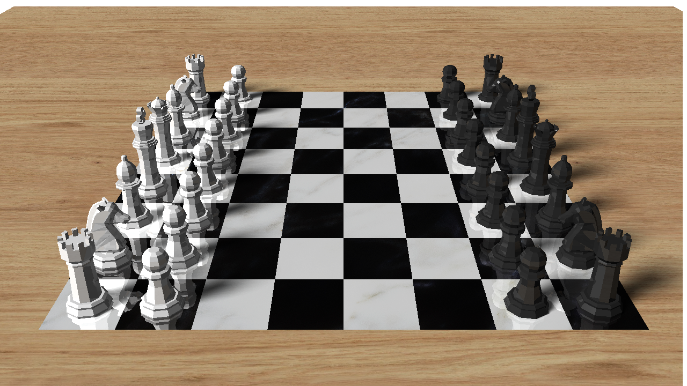

# 3D Engine Project

## Table of Contents

- [Project Description](#project-description)
- [Contributors](#contributors)
- [Quick Start](#quick-start)
- [Installation](#installation)
  - [Linux](#linux)
    - [Dependencies](#dependencies)
    - [Compilation and Execution](#compilation-and-execution)
  - [macOS](#macos)
    - [Dependencies](#dependencies-1)
    - [Compilation and Execution](#compilation-and-execution-1)
- [Development](#development)
    - [Configuration and Assets](#configuration-and-assets)
    - [How to do Profiling](#how-to-do-profiling)
- [Examples and Screenshots](#examples-and-screenshots)

## Project Description

This project is a custom 3D engine developed as part of the fourth-year curriculum at ESIEE Engineering School. It utilizes SFML solely for writing pixels to the window from a custom image buffer. Every aspect of the image generation process is 100% custom-made, including a bespoke Color class, which features a `.toSFML()` method for compatibility with SFML. The engine is crafted to be lightweight and educational, aiming to showcase the principles of 3D graphics programming in detail.

The engine supports the following features:
- 3D object rendering (spheres, triangles, parallelograms, and meshes)
- Basic lighting (ambient and directional)
- Texture mapping
- Bump mapping
- Reflections
- Refractions
- Shadows
- Octree optimization
- Multithreading
- Saving images to disk
- JSON configuration files
- Error logging
- Custom image buffer, color, and vector classes

## Contributors

- [Tristan Nobre](https://github.com/GMoxFr)
- [Julien Hellequin](https://github.com/JulienHELLEQUIN)
- [William Preux](https://github.com/preuxw)

## Quick Start

Clone the repository, install dependencies, compile the project, and run a basic demo using the following commands:

```bash
git clone git@github.com:GMoxFr/3d-engine.git
cd 3d-engine
./install_dependencies.sh
make
./3d-engine -C assets/confs/sample_config.json
```

## Installation

### Linux

#### Dependencies

Install the required dependencies:
```bash
apt-get install build-essential libsfml-dev make nlohmann-json3-dev
```
Alternatively, run the provided script: 
```bash
./install_dependencies.sh
```

#### Compilation and Execution

In order to compile the project, you have to use the provided Makefile. To do so, run the following command:

```bash
make # Compile the project (I recommend using the -j flag to speed up the compilation)
make re # Recompile the project
make clean # Clean the project object files
make fclean # Clean the project and remove the executable

# Additionally, you can compile the project with optimizations using the following command:
make fast
```

### macOS

Installation steps for macOS are similar to Linux, using Homebrew for package management.

#### Dependencies

Install the required dependencies:
```bash
brew install sfml openal-soft make nlohmann-json
```
Alternatively, run the provided script: 
```bash
./install_dependencies.sh
```

#### Compilation and Execution

In order to compile the project, you have to use the provided Makefile. To do so, run the following command:

```bash
# General compilation commands using the Makefile
make # Compile the project (I recommend using the -j flag to speed up the compilation)
make re # Recompile the project
make clean # Clean the project object files
make fclean # Clean the project and remove the executable

# Additionally, you can compile the project with optimizations using the following command:
make fast
```

## Development

The project's architecture is clearly structured with source files, headers, and error logs each in their respective directories. Here's a detailed overview of the project's structure:
```
3d-engine/
├── assets/                     # Configuration files and textures
│   ├── confs/                  # Configuration files
│   ├── models/                 # 3D models
│   ├── renders/                # Pre-rendered images
│   └── textures/               # Textures & Bump maps
├── errors/                     # Error logs (compilation, linking, etc.)
├── include/                    # Header files
│   ├── lights/                 # Light headers
│   └── shapes/                 # Shape headers
├── main/                       # Main source files
└── src/                        # Source files
    └── class/                  # Class source files
        ├── myColor/            # Color class source files
        ├── myImage/            # Image class source files
        ├── myMesh/             # Mesh class source files
        ├── myParrallelogram/   # Parallelogram class source files
        ├── myPoint/            # Point class source files
        ├── mySphere/           # Sphere class source files
        ├── myTexture/          # Texture class source files
        ├── myTriangle/         # Triangle class source files
        └── myVector3/          # Vector3 class source files
```
    


### Configuration and Assets

- Demo configuration files are located in `assets/confs/*.json`.
- Textures & bump maps should be placed in `assets/textures/*` with `.png` or `.jpg` formats.
- 3D models should be placed in `assets/models/*` with `.obj` format.
- Pre-rendered images are available in `assets/renders/*.png`.

### How to do Profiling

To profile the project, we're using `gprof`. To do so, compile the project using `make profiling` and run the executable. Then, execute the following command:

```bash
gprof 3d-engine gmon.out > analysis.txt
```

## Examples and Screenshots

Here are some examples of the engine's capabilities:

*Here's a chessboard showing reflections, refractions, shadows, and mesh rendering.*
